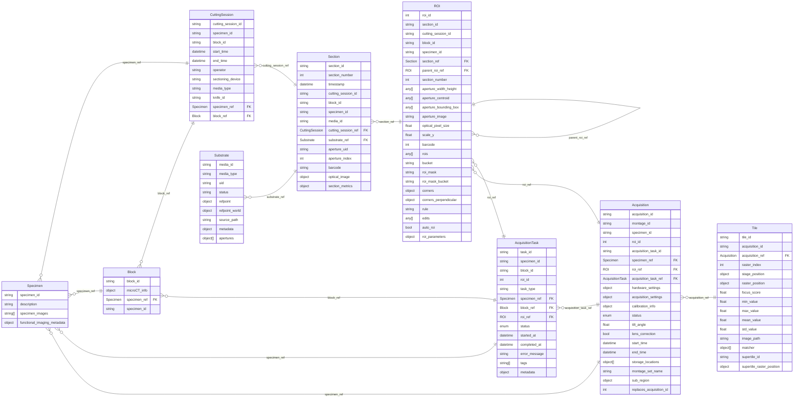

# Imaging Workflow Schema.

```mermaid
erDiagram
    direction LR
    Acquisition {
        string acquisition_id
        string montage_id
        string specimen_id
        int roi_id
        string acquisition_task_id
        Specimen specimen_ref FK
        ROI roi_ref FK
        AcquisitionTask acquisition_task_ref FK
        object hardware_settings
        object acquisition_settings
        object calibration_info
        enum status
        float tilt_angle
        bool lens_correction
        datetime start_time
        datetime end_time
        object[] storage_locations
        string montage_set_name
        object sub_region
        int replaces_acquisition_id
    }
    AcquisitionTask {
        string task_id
        string specimen_id
        string block_id
        int roi_id
        string task_type
        Specimen specimen_ref FK
        Block block_ref FK
        ROI roi_ref FK
        enum status
        datetime started_at
        datetime completed_at
        string error_message
        string[] tags
        object metadata
    }
    Block {
        string block_id
        object microCT_info
        Specimen specimen_ref FK
        string specimen_id
    }
    CuttingSession {
        string cutting_session_id
        string specimen_id
        string block_id
        datetime start_time
        datetime end_time
        string operator
        string sectioning_device
        string media_type
        string knife_id
        Specimen specimen_ref FK
        Block block_ref FK
    }
    ROI {
        int roi_id
        string section_id
        string cutting_session_id
        string block_id
        string specimen_id
        Section section_ref FK
        ROI parent_roi_ref FK
        int section_number
        any[] aperture_width_height
        any[] aperture_centroid
        any[] aperture_bounding_box
        string aperture_image
        float optical_pixel_size
        float scale_y
        int barcode
        any[] rois
        string bucket
        string roi_mask
        string roi_mask_bucket
        object corners
        object corners_perpendicular
        string rule
        any[] edits
        bool auto_roi
        object roi_parameters
    }
    Section {
        string section_id
        int section_number
        datetime timestamp
        string cutting_session_id
        string block_id
        string specimen_id
        string media_id
        CuttingSession cutting_session_ref FK
        Substrate substrate_ref FK
        string aperture_uid
        int aperture_index
        string barcode
        object optical_image
        object section_metrics
    }
    Specimen {
        string specimen_id
        string description
        string[] specimen_images
        object functional_imaging_metadata
    }
    Substrate {
        string media_id
        string media_type
        string uid
        string status
        object refpoint
        object refpoint_world
        string source_path
        object metadata
        object[] apertures
    }
    Tile {
        string tile_id
        string acquisition_id
        Acquisition acquisition_ref FK
        int raster_index
        object stage_position
        object raster_position
        float focus_score
        float min_value
        float max_value
        float mean_value
        float std_value
        string image_path
        object[] matcher
        string supertile_id
        object supertile_raster_position
    }

    Acquisition }o--|| Tile : acquisition_ref
    AcquisitionTask }o--|| Acquisition : acquisition_task_ref
    Block }o--|| AcquisitionTask : block_ref
    Block }o--|| CuttingSession : block_ref
    CuttingSession }o--|| Section : cutting_session_ref
    ROI }o--|| Acquisition : roi_ref
    ROI }o--|| AcquisitionTask : roi_ref
    ROI }o--|| ROI : parent_roi_ref
    Section }o--|| ROI : section_ref
    Specimen }o--|| Acquisition : specimen_ref
    Specimen }o--|| AcquisitionTask : specimen_ref
    Specimen }o--|| Block : specimen_ref
    Specimen }o--|| CuttingSession : specimen_ref
    Substrate }o--|| Section : substrate_ref
```