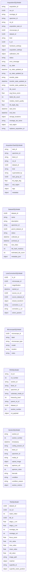

# Imaging Workflow Schema.

```mermaid
erDiagram
    direction LR
    AcquisitionSQLModel {
        string acquisition_id
        UUID run_id
        string montage_id
        string specimen_id
        string roi_id
        string acquisition_task_id
        UUID microscope_id
        UUID dataset_id
        string kind
        UUID lc_id
        object hardware_settings
        object acquisition_settings
        object calibration_info
        string status
        string error_message
        string qc_state
        datetime qc_state_updated_at
        string qc_state_updated_by
        string transfer_state
        datetime transfer_state_updated_at
        string transfer_state_updated_by
        int tile_count
        float avg_focus_score
        int failed_tile_count
        float median_match_quality
        float tilt_angle_deg
        datetime start_time
        datetime end_time
        object storage_locations
        string montage_set_name
        object sub_region
        string replaces_acquisition_id
    }
    AcquisitionTaskSQLModel {
        string task_id
        string specimen_id
        string block_id
        string roi_id
        UUID dataset_id
        string kind
        string superseded_by
        UUID task_group_id
        float tilt_angle_deg
        object sub_region
        object tags
        object metadata
    }
    DatasetSQLModel {
        UUID dataset_id
        string name
        string description
        string specimen_id
        UUID parent_dataset_id
        string status
        datetime collected_at
        datetime archived_at
        string size_class
        int tile_hash_modulus
        int estimated_tile_count
        object metadata_json
    }
    LensCorrectionSQLModel {
        UUID lc_id
        UUID microscope_id
        int magnification
        datetime started_at
        UUID source_run_id
        UUID source_dataset_id
        object shared_transform
        string correction_x_uri
        string correction_y_uri
        object solver_params
    }
    MicroscopeSQLModel {
        UUID microscope_id
        string label
        string microscope_type
        string model
        string location
        string notes
    }
    ROISQLModel {
        string roi_id
        int roi_number
        string section_id
        string block_id
        string specimen_id
        string substrate_media_id
        int hierarchy_level
        string parent_roi_id
        UUID dataset_id
        int section_number
        object roi_payload
    }
    SectionSQLModel {
        string section_id
        int section_number
        datetime timestamp
        string cutting_session_id
        string block_id
        string specimen_id
        string media_id
        object optical_image
        string aperture_uid
        int aperture_index
        string barcode
        string condition
        string condition_reason
        object section_metrics
    }
    TileSQLModel {
        UUID dataset_id
        UUID run_id
        int raster_index
        UUID tile_id
        float stage_x_nm
        float stage_y_nm
        int montage_row
        int montage_col
        float focus_score
        float min_value
        float max_value
        float mean_value
        float std_value
        string image_path
        object matcher
        string supertile_id
        object supertile_raster_position
    }
```