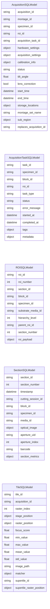

# Imaging Workflow Schema.

```mermaid
erDiagram
    direction LR
    AcquisitionSQLModel {
        string acquisition_id
        string montage_id
        string specimen_id
        string roi_id
        string acquisition_task_id
        object hardware_settings
        object acquisition_settings
        object calibration_info
        string status
        float tilt_angle
        bool lens_correction
        datetime start_time
        datetime end_time
        object storage_locations
        string montage_set_name
        object sub_region
        string replaces_acquisition_id
    }
    AcquisitionTaskSQLModel {
        string task_id
        string specimen_id
        string block_id
        string roi_id
        string task_type
        string status
        string error_message
        datetime started_at
        datetime completed_at
        object tags
        object metadata
    }
    ROISQLModel {
        string roi_id
        int roi_number
        string section_id
        string block_id
        string specimen_id
        string substrate_media_id
        int hierarchy_level
        string parent_roi_id
        int section_number
        object roi_payload
    }
    SectionSQLModel {
        string section_id
        int section_number
        datetime timestamp
        string cutting_session_id
        string block_id
        string specimen_id
        string media_id
        object optical_image
        string aperture_uid
        int aperture_index
        string barcode
        object section_metrics
    }
    TileSQLModel {
        string tile_id
        string acquisition_id
        int raster_index
        object stage_position
        object raster_position
        float focus_score
        float min_value
        float max_value
        float mean_value
        float std_value
        string image_path
        object matcher
        string supertile_id
        object supertile_raster_position
    }
```
