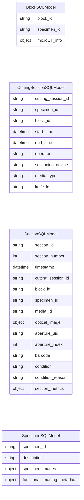

# Preparation Workflow Schema.

```mermaid
erDiagram
    direction LR
    BlockSQLModel {
        string block_id
        string specimen_id
        object microCT_info
    }
    CuttingSessionSQLModel {
        string cutting_session_id
        string specimen_id
        string block_id
        datetime start_time
        datetime end_time
        string operator
        string sectioning_device
        string media_type
        string knife_id
    }
    SectionSQLModel {
        string section_id
        int section_number
        datetime timestamp
        string cutting_session_id
        string block_id
        string specimen_id
        string media_id
        object optical_image
        string aperture_uid
        int aperture_index
        string barcode
        string condition
        string condition_reason
        object section_metrics
    }
    SpecimenSQLModel {
        string specimen_id
        string description
        object specimen_images
        object functional_imaging_metadata
    }
```