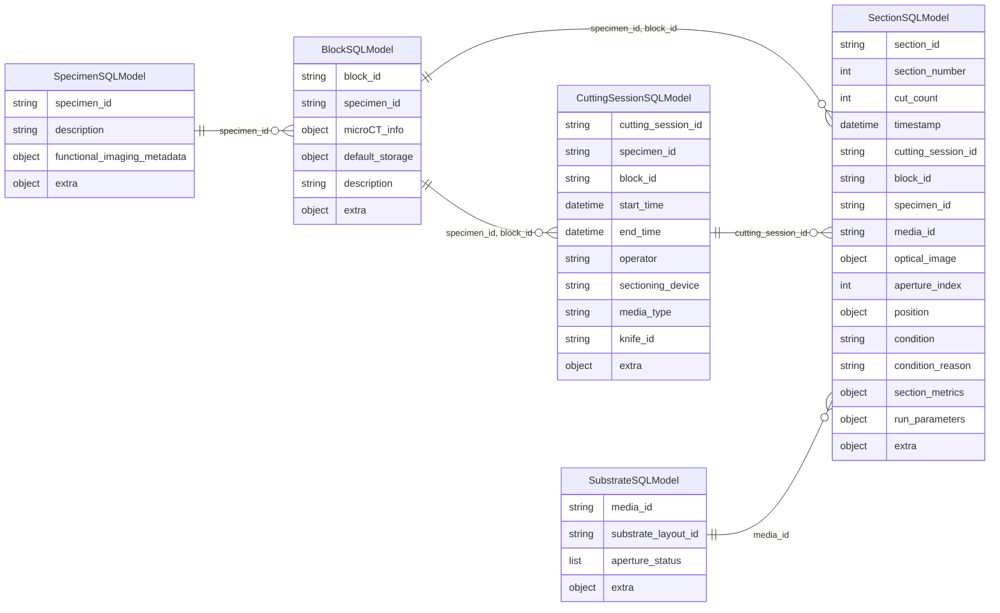

# Preparation Workflow Schema.

```mermaid
erDiagram
    direction LR
    BlockSQLModel ||--o{ CuttingSessionSQLModel : "specimen_id, block_id"
    BlockSQLModel ||--o{ SectionSQLModel : "specimen_id, block_id"
    CuttingSessionSQLModel ||--o{ SectionSQLModel : "cutting_session_id"
    SpecimenSQLModel ||--o{ BlockSQLModel : "specimen_id"
    SubstrateSQLModel ||--o{ SectionSQLModel : "media_id"
    BlockSQLModel {
        string block_id
        string specimen_id
        object microCT_info
        object default_storage
        string description
        object extra
    }
    CuttingSessionSQLModel {
        string cutting_session_id
        string specimen_id
        string block_id
        datetime start_time
        datetime end_time
        string operator
        string sectioning_device
        string media_type
        string knife_id
        object extra
    }
    SectionSQLModel {
        string section_id
        int section_number
        int cut_count
        datetime timestamp
        string cutting_session_id
        string block_id
        string specimen_id
        string media_id
        object optical_image
        int aperture_index
        object position
        string condition
        string condition_reason
        object section_metrics
        object run_parameters
        object extra
    }
    SpecimenSQLModel {
        string specimen_id
        string description
        object functional_imaging_metadata
        object extra
    }
    SubstrateSQLModel {
        string media_id
        string substrate_layout_id
        list aperture_status
        object extra
    }
```
