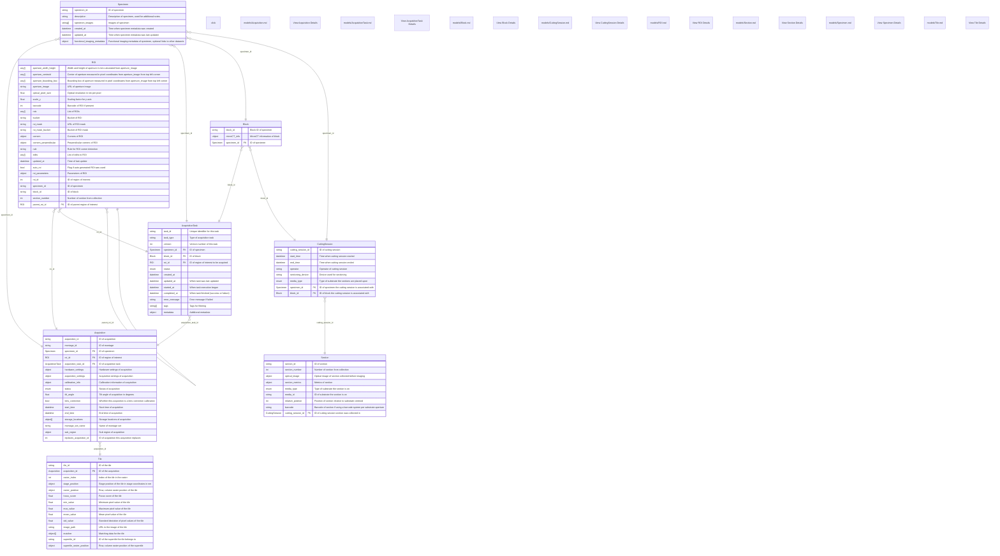

# Database Schema ERD

Click on an entity to see more details.

```mermaid
erDiagram
    Acquisition {
        string acquisition_id "ID of acquisition"
        string montage_id "ID of montage"
        Specimen specimen_id FK "ID of specimen"
        ROI roi_id FK "ID of region of interest"
        AcquisitionTask acquisition_task_id FK "ID of acquisition task"
        object hardware_settings "Hardware settings of acquisition"
        object acquisition_settings "Acquisition settings of acquisition"
        object calibration_info "Calibration information of acquisition"
        enum status "Status of acquisition"
        float tilt_angle "Tilt angle of acquisition in degrees"
        bool lens_correction "Whether this acquisition is a lens correction calibration"
        datetime start_time "Start time of acquisition"
        datetime end_time "End time of acquisition"
        object[] storage_locations "Storage locations of acquisition"
        string montage_set_name "Name of montage set"
        object sub_region "Sub region of acquisition"
        int replaces_acquisition_id "ID of acquisition this acquisition replaces"
    }
    Block {
        string block_id "Block ID of specimen"
        object microCT_info "MicroCT information of block"
        Specimen specimen_id FK "ID of specimen"
    }
    CuttingSession {
        string cutting_session_id "ID of cutting session"
        datetime start_time "Time when cutting session started"
        datetime end_time "Time when cutting session ended"
        string operator "Operator of cutting session"
        string sectioning_device "Device used for sectioning"
        enum media_type "Type of substrate the sections are placed upon"
        Specimen specimen_id FK "ID of specimen the cutting session is associated with"
        Block block_id FK "ID of block the cutting session is associated with"
    }
    ROI {
        any[] aperture_width_height "Width and height of aperture in mm calculated from aperture_image"
        any[] aperture_centroid "Center of aperture measured in pixel coordinates from aperture_image from top left corner"
        any[] aperture_bounding_box "Bounding box of aperture measured in pixel coordinates from aperture_image from top left corner"
        string aperture_image "URL of aperture image"
        float optical_pixel_size "Optical resolution in nm per pixel"
        float scale_y "Scaling factor for y-axis"
        int barcode "Barcode of ROI if present"
        any[] rois "List of ROIs"
        string bucket "Bucket of ROI"
        string roi_mask "URL of ROI mask"
        string roi_mask_bucket "Bucket of ROI mask"
        object corners "Corners of ROI"
        object corners_perpendicular "Perpendicular corners of ROI"
        string rule "Rule for ROI corner detection"
        any[] edits "List of edits to ROI"
        datetime updated_at "Time of last update"
        bool auto_roi "Flag if auto generated ROI was used"
        object roi_parameters "Parameters of ROI"
        int roi_id "ID of region of interest"
        string specimen_id "ID of specimen"
        string block_id "ID of block"
        int section_number "Number of section from collection"
        ROI parent_roi_id FK "ID of parent region of interest"
    }
    Section {
        string section_id "ID of section"
        int section_number "Number of section from collection"
        object optical_image "Optical image of section collected before imaging"
        object section_metrics "Metrics of section"
        enum media_type "Type of substrate the section is on"
        string media_id "ID of substrate the section is on"
        int relative_position "Position of section relative to substrate centroid"
        string barcode "Barcode of section if using a barcode system per substrate aperture"
        CuttingSession cutting_session_id FK "ID of cutting session section was collected in"
    }
    Specimen {
        string specimen_id "ID of specimen"
        string description "Description of specimen, used for additional notes."
        string[] specimen_images "Images of specimen"
        datetime created_at "Time when specimen metadata was created"
        datetime updated_at "Time when specimen metadata was last updated"
        object functional_imaging_metadata "Functional imaging metadata of specimen, optional links to other datasets"
    }
    AcquisitionTask {
        string task_id "Unique identifier for this task"
        string task_type "Type of acquisition task"
        int version "Version number of this task"
        Specimen specimen_id FK "ID of specimen"
        Block block_id FK "ID of block"
        ROI roi_id FK "ID of region of interest to be acquired"
        enum status
        datetime created_at
        datetime updated_at "When task was last updated"
        datetime started_at "When task execution began"
        datetime completed_at "When task finished (success or failure)"
        string error_message "Error message if failed"
        string[] tags "Tags for filtering"
        object metadata "Additional metadata"
    }
    Tile {
        string tile_id "ID of the tile"
        Acquisition acquisition_id FK "ID of the acquisition"
        int raster_index "Index of the tile in the raster"
        object stage_position "Stage position of the tile in stage coordinates in nm"
        object raster_position "Row, column raster position of the tile"
        float focus_score "Focus score of the tile"
        float min_value "Minimum pixel value of the tile"
        float max_value "Maximum pixel value of the tile"
        float mean_value "Mean pixel value of the tile"
        float std_value "Standard deviation of pixel values of the tile"
        string image_path "URL to the image of the tile"
        object[] matcher "Matching data for the tile"
        string supertile_id "ID of the supertile the tile belongs to"
        object supertile_raster_position "Row, column raster position of the supertile"
    }

    Acquisition }o--|| Tile : acquisition_id
    AcquisitionTask }o--|| Acquisition : acquisition_task_id
    Block }o--|| AcquisitionTask : block_id
    Block }o--|| CuttingSession : block_id
    CuttingSession }o--|| Section : cutting_session_id
    ROI }o--|| Acquisition : roi_id
    ROI }o--|| AcquisitionTask : roi_id
    ROI }o--|| ROI : parent_roi_id
    Specimen }o--|| Acquisition : specimen_id
    Specimen }o--|| AcquisitionTask : specimen_id
    Specimen }o--|| Block : specimen_id
    Specimen }o--|| CuttingSession : specimen_id

    click Acquisition "models/Acquisition.md" "View Acquisition Details"
    click AcquisitionTask "models/AcquisitionTask.md" "View AcquisitionTask Details"
    click Block "models/Block.md" "View Block Details"
    click CuttingSession "models/CuttingSession.md" "View CuttingSession Details"
    click ROI "models/ROI.md" "View ROI Details"
    click Section "models/Section.md" "View Section Details"
    click Specimen "models/Specimen.md" "View Specimen Details"
    click Tile "models/Tile.md" "View Tile Details"
```